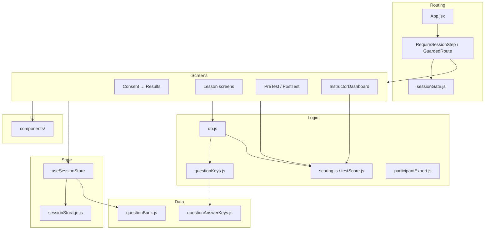

# C4 — Components (React application)

Logical modules inside the SPA container.

## Routing layer

| Module | Responsibility |
| ------ | -------------- |
| `App.jsx` | Route table, lazy imports, basename |
| `RequireSessionStep` | Wraps routes; runs gate checks |
| `sessionGate.js` | `CHECK_ORDER`, redirects, lesson resume path |

## Screens (`src/screens/`)

One component per learner step (and instructor). Screens receive `session` from the parent — they do not create a second store instance.

Typical responsibilities:

- Render lesson or test UI
- Call `recordScreenEnter` / `recordScreenExit` for timing
- Invoke `db.js` save helpers on milestones
- Navigate with React Router (`replace: true` after irreversible steps)

## Session store (`src/store/`)

| Piece | Role |
| ----- | ---- |
| `useSessionStore` | React hook: IDs, questions, answers, flags |
| `pickQuestions()` | 2 random questions × 5 topics |
| `sessionStorage.js` | Serialize/deserialize to `localStorage` |

## Library (`src/lib/`)

| Module | Role |
| ------ | ---- |
| `db.js` | All Supabase RPC wrappers |
| `sessionGate.js` | Progress gating pure functions |
| `scoring.js` | LO breakdown, cohort stats, CSV |
| `testScore.js` | Point-in-time test scoring |
| `questionKeys.js` | Lazy answer key loader |
| `supabase.js` | Client singleton |

## Data (`src/data/`)

| File | Exposed when |
| ---- | ------------ |
| `questionBank.js` | Test UI (no keys) |
| `questionAnswerKeys.js` | Save + results only |

## Components (`src/components/`)

Shared layout and interaction: `PageLayout`, parchment frames, quiz widgets, glossary, keyword tooltips, skeleton loaders.

## Supabase integration boundary

All writes cross **`src/lib/db.js`** only. Screens should not call `supabase.rpc` directly — keeps logging, error shape, and patch keys consistent.

See [API reference](/api/) for RPC contracts.
