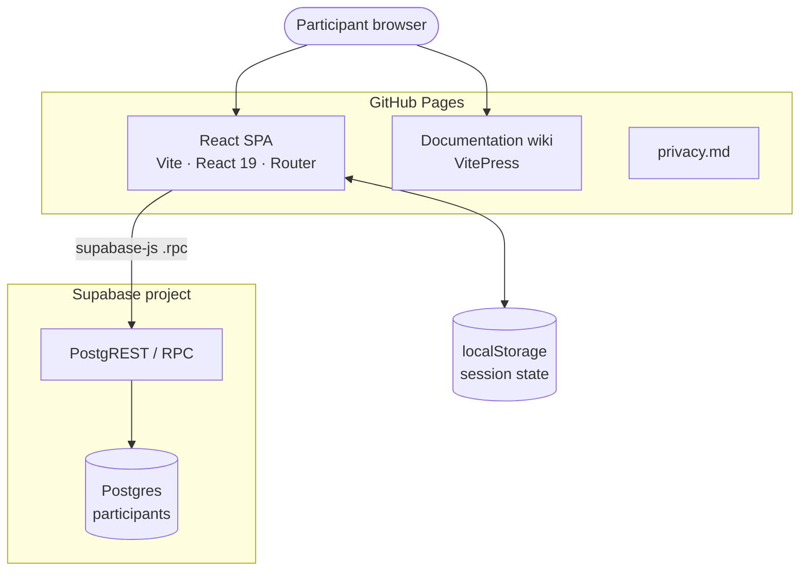
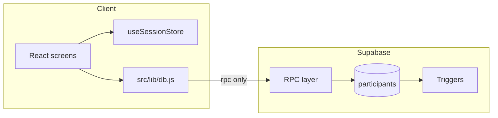

# C4 — Containers

Deployable units and how they communicate.

## React SPA (`docs/` after build)

| Aspect | Detail |
| ------ | ------ |
| **Built by** | `npm run build` → `docs/` |
| **Base path** | `/HCI520-MTG-learning-site/` (`vite.config.js`) |
| **Routing** | Client-side `BrowserRouter` with same basename |
| **Config** | `VITE_SUPABASE_URL`, `VITE_SUPABASE_ANON_KEY` baked in at build time |

The SPA bundles React screens, the session store, question bank (without keys during tests), and Supabase client calls.

## Browser local storage

`src/store/sessionStorage.js` persists:

- `sessionId`, `sessionSecret`
- Selected questions, answers, progress flags
- Screen time aggregates

Allows refresh recovery without re-drawn questions. `get_participant_progress` RPC reconciles server flags on load.

## Supabase Postgres

| Artifact | Purpose |
| -------- | ------- |
| `participants` | One row per anonymous session |
| `study_privacy_config` | Retention settings (not client-readable) |
| Triggers | `validate_participant_row` (shape, scores, progress ordering) |
| Private functions | `hash_session_secret`, `purge_expired_participants` |

## Documentation wiki

| Aspect | Detail |
| ------ | ------ |
| **Source** | `documentation/` |
| **Built by** | `npm run docs:build` |
| **Deployed to** | `docs/wiki/` (copied after app build in CI) |
| **Base path** | `/HCI520-MTG-learning-site/wiki/` |

## Communication rules

Not used in production: `supabase.from('participants').insert()`, `.update()`, or `.select()` for cohort reads.
