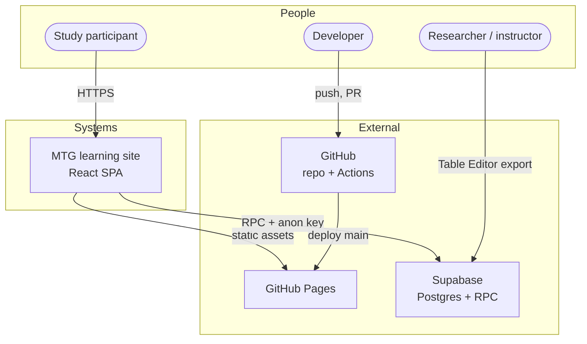

# C4 — System context

Shows who uses the system and which external services it depends on.

## Actors

### Study participant

- Anonymous session identified by a displayed **save code** (`session_id`).
- No account login. Progress persists in **browser storage** and is mirrored to Supabase when saves succeed.
- Cannot read other participants' rows.

### Researcher / instructor

- Uses the Supabase Table Editor (or SQL with service role) for cohort export.
- `/instructor` dashboard UI exists but cannot read rows when deny-select RLS is active. That is normal.

### Developer / contributor

- Maintains application code, question bank, SQL, and this wiki.
- CI validates lint, tests, build, and (on deploy) E2E.

## External systems

| System | Role |
| ------ | ---- |
| **GitHub Pages** | Serves the Vite build at `/HCI520-MTG-learning-site/` and wiki at `/HCI520-MTG-learning-site/wiki/` |
| **Supabase** | Stores `participants` rows; exposes RPCs to anon role |
| **GitHub Actions** | CI on PRs; build + deploy on `main` |

## Out of scope

- Wizards of the Coast / MTG Arena APIs
- User authentication (OAuth, email accounts)
- Server-side rendering or edge functions for this app (all logic is client + Postgres RPC/triggers)
