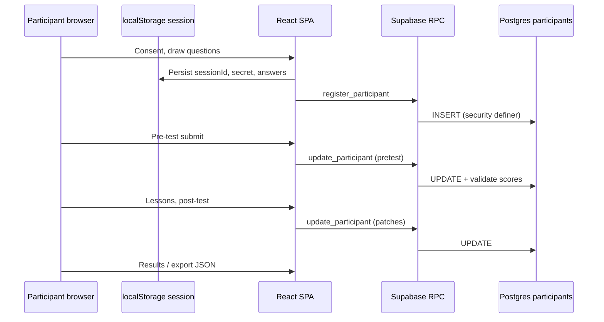

# Architecture overview

The HCI520 MTG learning site is a static React SPA on GitHub Pages with a Supabase Postgres backend for anonymous participant data. There is no custom application server. The browser talks to Supabase over HTTPS with the public anon key; row-level security and RPCs enforce access rules.

## C4 model index

| Level | Document | What it shows |
| ----- | -------- | ------------- |
| **Context** | [Context diagram](/architecture/context) | People and external systems |
| **Containers** | [Containers](/architecture/containers) | Deployable/runtime units |
| **Components** | [Components](/architecture/components) | Major modules inside the React app |
| **Dynamic** | [Session gating](/architecture/session-flow) | Learner progress and redirects |
| **Deployment** | [Deployment](/architecture/deployment) | CI, GitHub Pages, Supabase |

## Data flow (typical session)

## Security principles

1. Deny SELECT on `participants` for `anon`. Cohort data is not readable from the study site.
2. No anon INSERT or UPDATE on the table. Writes go through security definer RPCs with `session_secret` verification.
3. Server-side score recompute: triggers ignore tampered client scores.
4. Answer keys load only at save and results time, not in the active test bundle path.

## See also

- [API reference](/api/)
- [Contributor guide](/guide/getting-started)
- [Evaluation metrics](/guide/evaluation)
