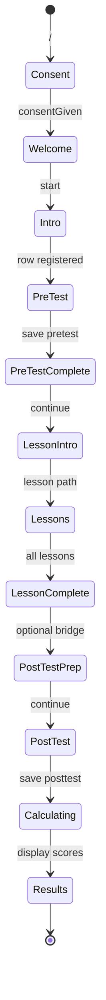

# Session gating

Learners follow a **linear 15-step path**. `RequireSessionStep` enforces prerequisites using `sessionGate.js` before rendering a route.

## Gate check order

```text
consent → questions → rowReady → pretest → lessons → posttest
```

| Gate key | Session condition | Redirect if failed |
| -------- | ----------------- | ------------------ |
| `consent` | `consentGiven` | `/` |
| `questions` | `selectedQuestions != null` | `/welcome` |
| `rowReady` | `participantRowReady` | `/welcome` |
| `pretest` | `pretestCompleted` | `/pretest` |
| `lessons` | `lessonsCompleted` | Resume lesson path |
| `posttest` | `posttestCompleted` | `/posttest` |

`/instructor` is **not** wrapped in these gates.

## Flow diagram



## Lesson resume

If `lessons` gate fails, `getLessonsResumePath(screenTimes)` picks the most recently visited lesson screen (or lesson intro). Lesson order:

```text
/lesson/intro → /what-is-mtg → /lesson/1 → /lesson/2 → /lesson/3 → /lesson/4
```

## Browser back blocking

Most study screens call `useBlockBrowserBack` so participants use on-screen **Back / Continue** instead of history navigation.

## Server reconciliation

On load, when `participantRowReady`, the store calls `get_participant_progress` to sync:

- `pretest_completed`, `lessons_completed`, `posttest_completed`
- Stored scores (for recovery display)

This prevents local storage drift from unlocking steps the server has not recorded.

## Registration timing

1. Welcome → Intro: participant copies save code.
2. Intro: `createParticipantRow` → `register_participant` with `selected_questions` (includes server-side `correctIndex` via `attachAnswerKeys`).
3. Until `participantRowReady`, pre-test save is blocked.

## Progress flags vs database

| Flag | Set when |
| ---- | -------- |
| `pretestCompleted` | Pre-test RPC save succeeds |
| `lessonsCompleted` | Lesson complete save |
| `posttestCompleted` | Post-test RPC save succeeds |
| `completed_at` (DB) | Same as post-test submit |

Post-test answers require `lessons_completed` and `pretest_answers` on the server (trigger enforced).

## Implementation files

- `src/lib/sessionGate.js` — `getRedirectInfo`, `CHECK_ORDER`, notices
- `src/components/RequireSessionStep.jsx` — route wrapper
- `src/App.jsx` — `GuardedRoute` definitions
